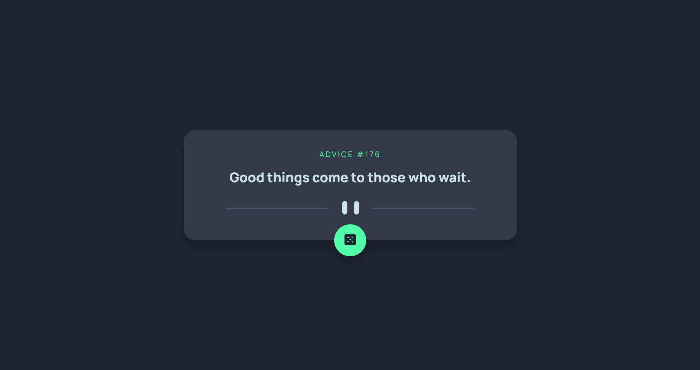

# Frontend Mentor - Advice generator app solution

This is a solution to the [Advice generator app challenge on Frontend Mentor](https://www.frontendmentor.io/challenges/advice-generator-app-QdUG-13db). Frontend Mentor challenges help you improve your coding skills by building realistic projects.

## Table of contents

- [Overview](#overview)
  - [The challenge](#the-challenge)
  - [Screenshot](#screenshot)
  - [Links](#links)
  - [What I learned & What's next](#what-i-learned)
- [Author](#author)

## Overview

### The challenge

Users should be able to:

- View the optimal layout for the app depending on their device's screen size
- See hover states for all interactive elements on the page
- Generate a new piece of advice by clicking the dice icon

### Screenshot



### Links

- Solution URL: [https://github.com/spaziutempu/advice-generator-app](https://github.com/spaziutempu/advice-generator-app)
- Live Site URL: [https://adorable-platypus-b682b3.netlify.app](https://adorable-platypus-b682b3.netlify.app/)

### Built with

- Semantic HTML5 markup
- Flexbox
- Mobile-first workflow
- API

### What I learned & What's next

- How to re-use fetch

```js
fetch("https://api.adviceslip.com/advice").then((res) => res.json());
```

- need to deep dive into API to be good with;

## Author

- Website - [spaziu](https://github.com/spaziutempu)
